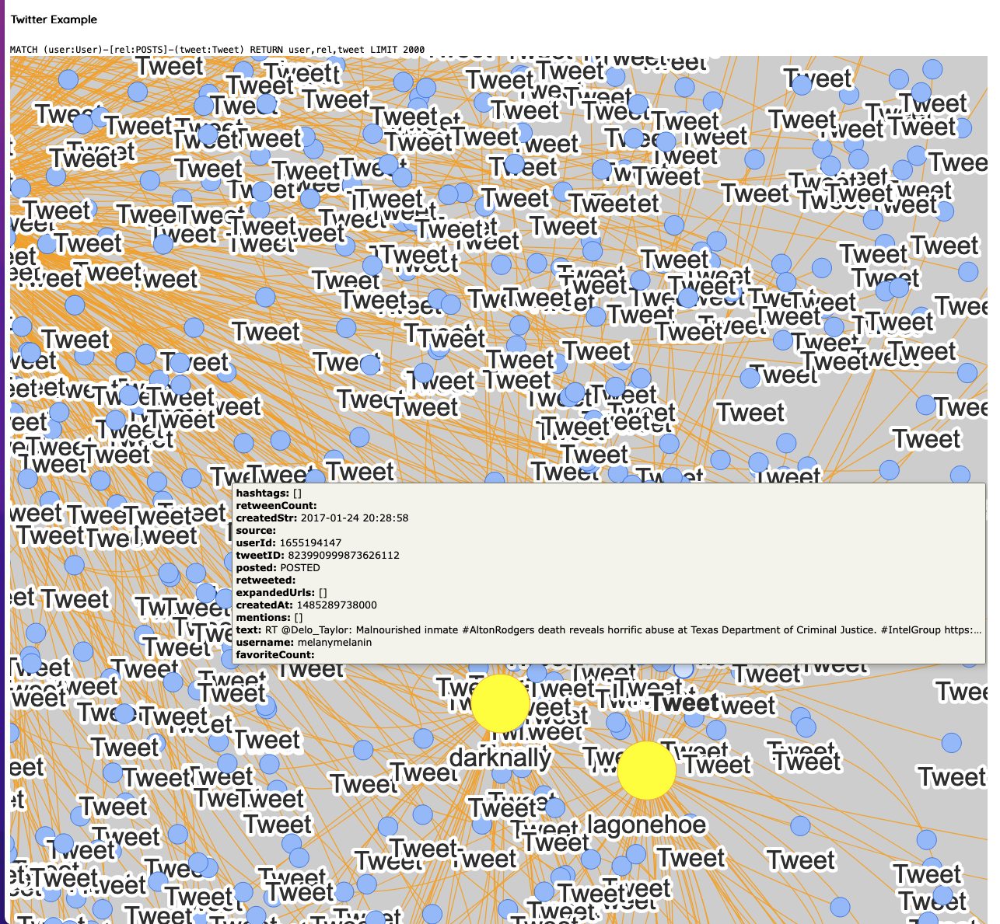

# Neo4J/NeoVis with React and Russian Twitter Troll Data

Uses Data released by NBC from their Investigation into Russian Twitter Trolls during the 2016 United States Election

Source: https://www.nbcnews.com/tech/social-media/now-available-more-200-000-deleted-russian-troll-tweets-n844731

Current Example Query:

`MATCH (m)-[r]-(n) RETURN m,r,n LIMIT 2000`

Query can be Modified in /frontend/src/components/App.js

Uses NeoVis.js and React-NeoVis

NeoVis: https://github.com/neo4j-contrib/neovis.js/

React-NeoVis: https://github.com/jackdbd/react-neovis-example

To Launch Local Deployment in Project Folder (must have Docker installed - https://docs.docker.com/get-docker/):

`docker-compose up`

Open browser to http://localhost:3000

To view current Neo4j database locally, open browser to http://localhost:7474 and login with username: Neo4j, password: Neo4j

